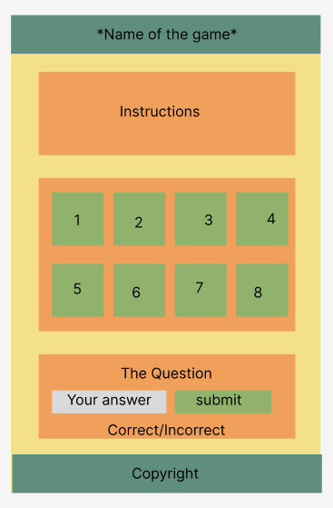
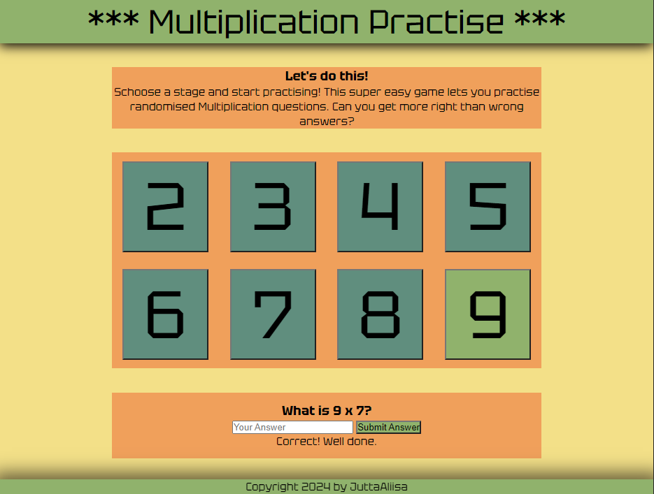
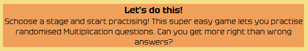
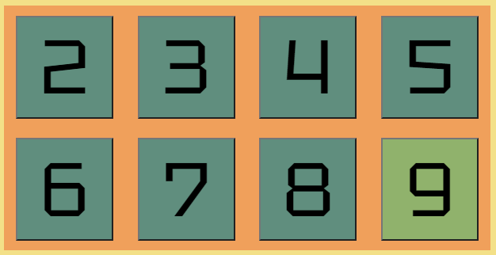
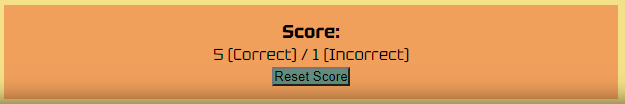

# Welcome - Multiplication Practice game

This is my seconf independent project as a up and coming full stack developer, Studying towards my Diploma with Code Institute.

[View this game on Github Pages](https://github.com/JuttaAliisa/mathGame)

# Content

- [Welcome - Multiplication Practise Game](#welcome---multiplication-practise-game)
- [Content](#content)
- [User experience](#user-experience)
  - [Key information](#key-information)
  - [Goal](#goal)
  - [User goals](#user-goals)
- [Design](#design)
  - [Fonts](#fonts)
  - [Wireframes](#wireframes)
- [Features](#features)
  - [Landing page](#landing-page)
  - [Footer](#footer)
  - [Content](#content-pages)
  - [upcoming features](#upcoming-features)
- [Technologies](#technologies)
  - [Languages](#languages)
  - [Resources](#resources)
- [Testing](#testing)
  - [Diagnostics](#diagnostics)
  - [Manual testing](#manual-testing)
  - [Fixed bugs](#fixed-bugs)
  - [Deployment](#deployment)
- [Credits](#credits)
  - [Content](#content-1)
  - [Media](#media)
  - [Acknowledgements](#acknowledgements)

# User experience

This website is a game-like environment for learning multiplication. This game is easy to use and can be played indefinitely. One page layout makes it easy to start and play.

No complicated instruction are needed and the website is easy to access with any device with internet access.

## Key information

- Preview what can be found from the site
- Detailed information about this game/practise site

## Goal

- Responsive site
- Easy access
- Easy to use

## User goals

- Easily access practise
  - Solution: one page layout grant an immediate access to the game
- freedom to choose the multiplication table to practise
  - Solution: you can select and change the table any time, completely freely.
- Score upkeeping
  - Solution: You will see your scores and they will include correct and incorrect answers. You can also reset the scores whenever you wish

# Design

## Fonts

- Main font from Google fonts Tektur

## Wireframes

Wireframes were created for mobile

# Features

## Landing page

- Landing page / frontpage is the only page for the site
- The meaning of this is to make the game super easy to access and allows user to fully concentrate on the game

- Scrolling is kept to minimal, being zero in mobile view and only scores need to be scrolled to in bigger screens.
- In larger screens the empty sides are ideal for add placement in case the site would be commercial.

## Footer

- The footer section includes copyright information

## Content

- Instruction section gives you some encouragement to start playing and goes through the meaning of the game within couple of sentences.

- The buttons let you choose the multiplication table you are playing with. You can change at any point and you score will stay until you choose to reset. When you press, the relevant question is posted immediately and after you answer the next one will be up right away until you choose different table

- The game section will have the question, mandatory and number only answer field and submit button. You will receive immediate feedback for your answer.

- The Score section will tell you how you are doing by calculating your right and wrong answers. You can also reset the score at any point by pressing the reset button.

## upcoming features

- The game will later include multible gamemodes with similar table system. 

# Technologies

## Languages

HTML and CSS and JavaScript were used for this website.

## Resources

- Figma - Used to create wireframes
- CodeAnywhere - To code
- Github - To save and store the files for the website.
- Google Fonts - To import the fonts used on the website.
- Google Dev Tools - To troubleshoot and test features, solve issues with responsiveness and styling.
- [Favicon.io](https://favicon.io/) To create favicon.
- [Am I Responsive?](http://ami.responsivedesign.is/) To show the website image on a range of devices.
  
# Testing

## Diagnostics

- HTML
  - No errors were returned when passing through the official [W3C validator](https://validator.w3.org/nu/?doc=https%3A%2F%2Fjuttaaliisa.github.io%2FmathGame%2F)
- CSS
  - No errors were found when passing through the official [(Jigsaw) validator](https://jigsaw.w3.org/css-validator/validator?uri=https%3A%2F%2Fvalidator.w3.org%2Fnu%2F%3Fdoc%3Dhttps%253A%252F%252Fcode-institute-org.github.io%252Flove-running-2.0%252Findex.html&profile=css3svg&usermedium=all&warning=1&vextwarning=&lang=en#css)
- Lighthouse
  - Accessibility 100
  - Best practises 100
  - SEO 100
  - performance 48/100 mainly because of bad image optimazation (next sprint agenda)
  
  [Disgnostics](docs/testing/diagnostics.png)

## Manual testing

To ensure that the site works, I tested forms, buttons and responsiveness manually with multiple devices and browsers:

- Lenovo Legion laptop
- Iphone 13PRO
- Macbook pro 13"
- iPad Pro 11"
- Safari
- Chrome
No problems were found
  
## Fixed bugs

- The only bug found during the project was "The element button must not appear as a descendant of the a element." This bug was fixed. The developer had no idea this was not valid HTML and the buttons were actually working before the fix.
- Some Javascript was necessary to use to quick fix this and the fix is not perfect, but the page was styled using buttons and there was not enough time to rewrite the whole code aroun a-element, the fix is in place until further notice.

No unfixed bugs remain.

## Deployment

The site was deployed to GitHub pages. The steps to deploy are as follows:

- In the GitHub repository, navigate to the Settings tab
- From the source section drop-down menu, select the Master Branch
- Once the master branch has been selected, the page will be automatically refreshed with a detailed ribbon display to indicate the successful deployment.
- The live link can be found here - [LINK](https://juttaaliisa.github.io/Aliica/index.html)

# Credits

## Content

- The texts are produced by Jutta Helin
- The header and footer design is inspired by the Code Institute walk through project "Love Running"
- The icons in the footer were taken from Font Awesome
- Instructions and inspiration (but no direct copy of the code) has been searched from <https://stackoverflow.com/> and <https://www.w3schools.com/> together with Code Institute tutorials from full stack development course.

## Media

- Pictures are created by Ilmari "Aliica" Helin
- Fonts from Google fonts
- Youtube colours from [Youtube resources](https://www.youtube.com/howyoutubeworks/resources/brand-resources/?_gl=1*6uwtl9*_up*MQ..*_ga*MTYyNTE2NTY4My4xNzAxNjE3MTc2*_ga_M0180HEFCY*MTcwMTYxNzE3NS4xLjAuMTcwMTYxNzI3MC4wLjAuMA..#logos-icons-and-colors)
- Responsive picture in readme from <https://ui.dev/>

## Acknowledgements

- My patient Mentor Jubril Akolade for support and instructions
- My everloving husband for granting me the time to make this project and further my education
- Code Institute for the opportunity
- My fellow OCT 2023 group for mental and peer support